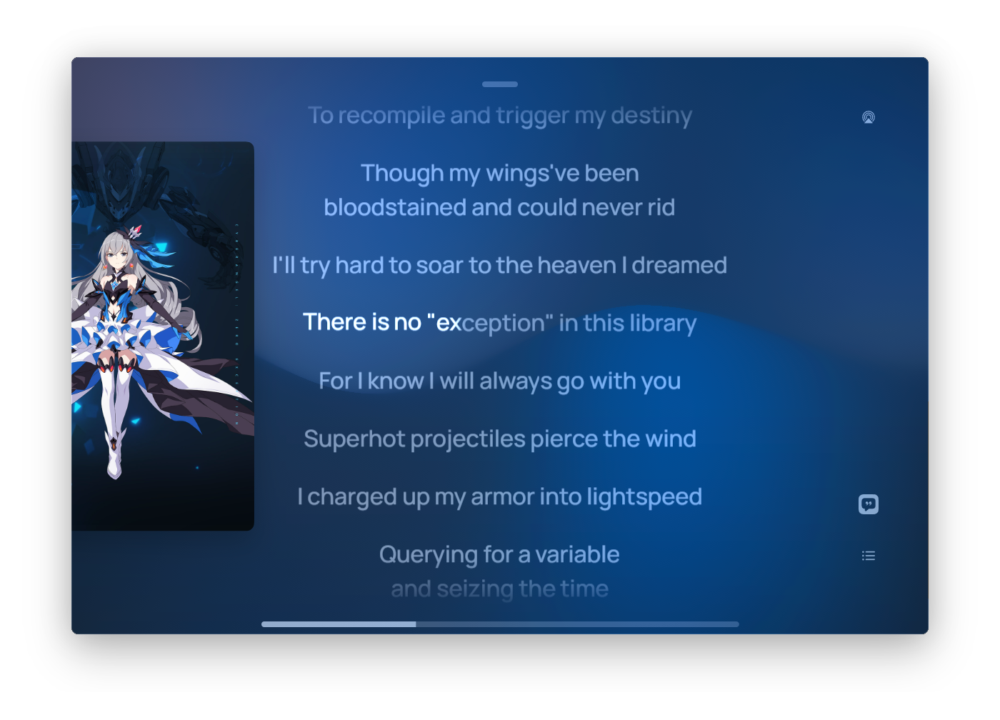
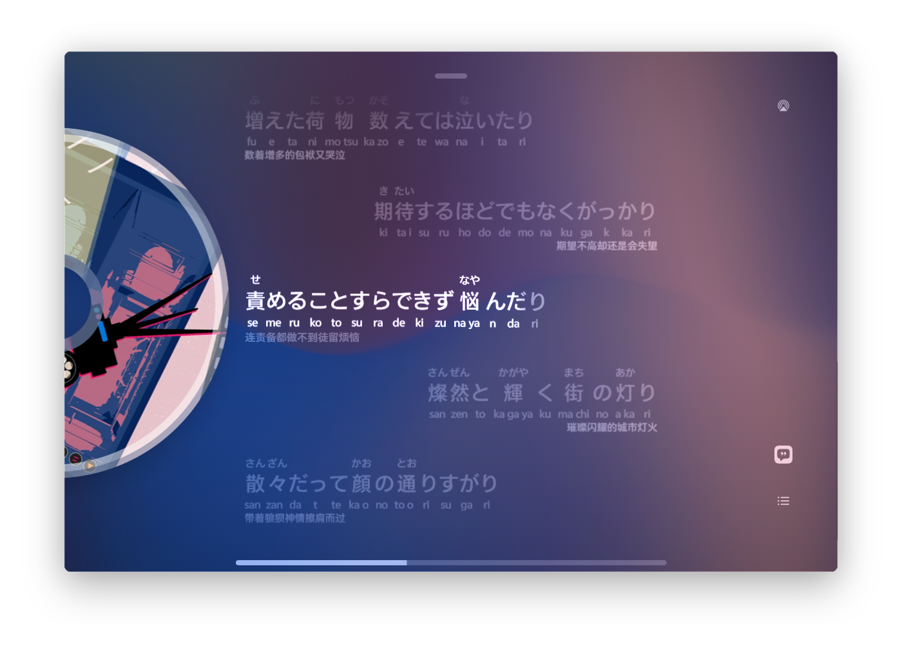
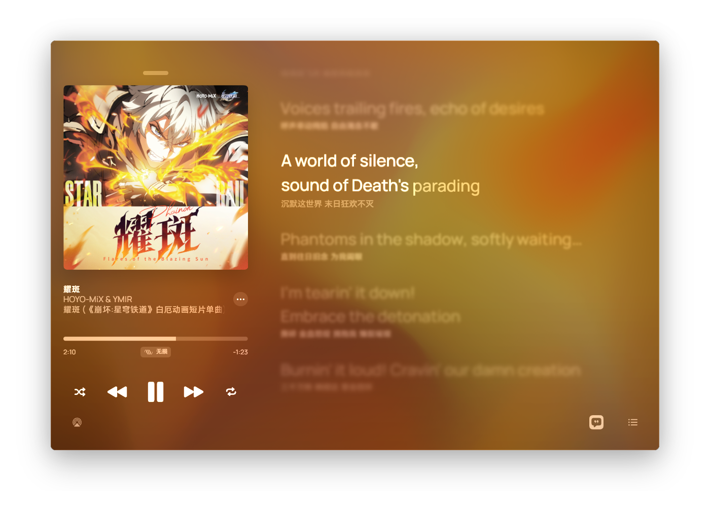
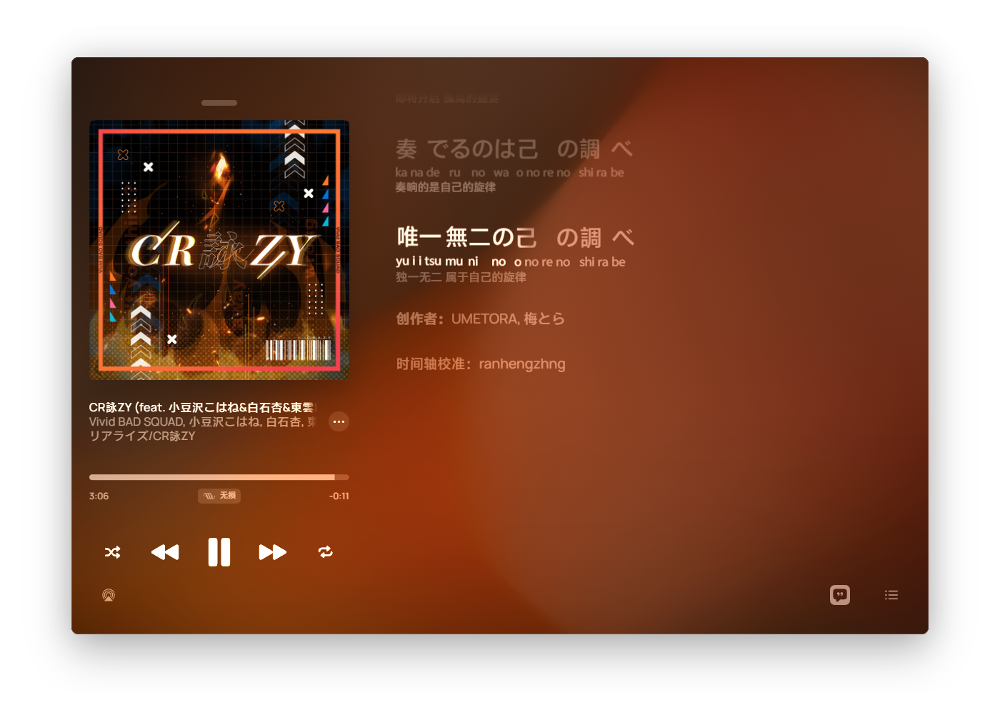

# UI Reset (UI 调整)

一个用于改善 AMLL Player **横版** 布局的插件，通过注入 CSS 实现调整 UI 布局的功能。

> [!WARNING]
>
> 部分功能由于 AMLL 及 AMLL Player 功能的更新已经失效或效果发生改变。

## 下载

- 从 [Github Actions](https://github.com/ranhengzhang/amll-player-ui-reset/actions/workflows/auto-build.yml) 页面下载自动构建的结果；
- 克隆 [仓库](https://github.com/ranhengzhang/amll-player-ui-reset) 到本地之后，执行 `pnpm i & pnpm build` 命令。

## 安装

将 `.js` 文件复制到 AMLL Player 插件文件夹中，重启 AMLL Player。

## 功能

### 布局调整

#### 无控制条时调整左半布局

当「设置」「歌曲信息样式」「播放控制组件类型」选项为「无」的时候调整左半边歌曲信息部分的布局更加紧凑、协调。

<ImageCompareSlider img-before="/amll-plugins/img/ui-reset/image-20260618221637289.png" img-after="/amll-plugins/img/ui-reset/image-20260618221649256.png" :initial-position="15" />

#### 修复「取消弹簧动画」时样式丢失

> [!CAUTION]
>
> AMLL Player 中已经修复，此项被弃用。

修复 **取消弹簧动画时，因为缺失 CSS 导致逐字效果丢失** 的 BUG

#### 播放条置顶

显示主页时，播放栏上方有几像素的高度因为向下偏移是没有背景色的，该选项设置补上背景色并矫正偏移。

<ImageCompareSlider img-before="/amll-plugins/img/ui-reset/image-20260618110551272.png" img-after="/amll-plugins/img/ui-reset/image-20260618110606454.png" />

#### 沉浸式歌词

大幅更改个此页面布局，将歌词作为主要显示内容。鼠标移走后将会延迟隐藏控制栏。



> [!TIP]
>
> 建议配合「圆形封面」功能使用，视觉效果更好。
>
> 

#### 没有对唱时居中对齐

如果当前歌词中 **完全没有对唱**，则会将歌词居中显示。

<ImageCarousel :images="[
  { src: '/amll-plugins/img/ui-reset/image-20260617015149892.png', alt: 'image-20260617015149892' },
  { src: '/amll-plugins/img/ui-reset/image-20260617022232734.png', alt: 'image-20260617022232734' }
]" />

#### 专辑信息和歌词部分占比

该选项用于调整播放页面中左右两部分区域的占比（开启「沉浸式歌词」功能时不会生效），更改过度时会导致元素错位。



#### 对齐歌词边距

> [!CAUTION]
>
> AMLL 中已修复，该项被弃用。

在旧版本的 AMLL 中背景行的边距与主行的边距有出入，故有此项更改。

#### 固定关闭按钮

将关闭按钮和横条固定在原位，不跟随鼠标移动。

#### 逐字音译间距

给音节之间的逐字音译添加间距，但是无法兼容逐字音译不规范或存在拨音音节的情况。

<ImageCompareSlider img-before="/amll-plugins/img/ui-reset/image-20260618220835733.png" img-after="/amll-plugins/img/ui-reset/image-20260618220900132.png" />

#### 逐字音译时隐藏行音译

> [!CAUTION]
>
> AMLL 已经修复该特性，此选项只需要在旧版 AMLL Player 中开启。

旧版 AMLL Player 中，在有逐字音译时还会重复显示一行逐行音译，该选项用于隐藏 **重复显示** 的逐行音译。

<ImageCompareSlider img-before="/amll-plugins/img/ui-reset/image-20260618223509294.png" img-after="/amll-plugins/img/ui-reset/image-20260618223403478.png" />

#### 逐字音译对齐

> [!CAUTION]
>
> AMLL 已修复该问题，此选项只需要在旧版 AMLL Player 中开启。

旧版的 AMLL 中，没有逐字音译的音节会下沉，该选项通过调整 flex 布局的顺序让音节原文靠底部显示/靠顶部显示。

#### 逐字音译居上

> [!CAUTION]
>
> AMLL 已经支持显示 Ruby，该选项可能导致非预计的效果，故已被弃用。

#### 歌词页额外信息

该选项用于在歌词的最底部显示一行自定义信息，如果在「歌词内容」「底部信息」中设置了「完全不显示」，那么此处设置的内容也不会显示。



### 额外兼容

> [!CAUTION]
>
> 此部分已经被废弃，AMLL 系列应用已经正式支持 Ruby 功能，并且能显示时间轴，无需额外兼容。

#### 兼容 ruby 注释

在 AMLL Player 中，打开播放页面摁下 <kbd> F12 </kbd> 后修改目标内容为以下格式可以显示标注（无时间轴）：

```html
<ruby><rt style="
left: 左边距px;
">注音内容</rt></ruby>
```

>  $$\texttt{left}_{rt}=\texttt{leftPadding}_{行}+\left(\sum^{n}_{i=0}\texttt{width}_{左边文字}\right) \divsymbol 2+\texttt{width}_{rt} \divsymbol 2$$

### 专辑封面

#### 透明底

该选项会将专辑封面背景从纯黑改为透明，用于显示异形封面。

<ImageCompareSlider img-before="/amll-plugins/img/ui-reset/image-20260619004909167.png" img-after="/amll-plugins/img/ui-reset/image-20260619004941631.png" :initial-position="25" />

#### 圆形封面

该选项会将播放栏和歌词页中的专辑封面显示为圆形。

<ImageCarousel :images="[
  { src: '/amll-plugins/img/ui-reset/image-20260619010633301.png', alt: 'image-20260619010633301' },
  { src: '/amll-plugins/img/ui-reset/image-20260619010356268.png', alt: 'image-20260619010356268' }
]" />

#### 仿真挖孔

该选项会添加三道环形半透明区域模拟 CD 效果。

<ImageCompareSlider img-before="/amll-plugins/img/ui-reset/image-20260619012322739.png" img-after="/amll-plugins/img/ui-reset/image-20260619012341601.png" :initial-position="25" />

#### 旋转封面

该选项会以固定周期旋转封面。

#### 旋转周期

该选项用于设置圆形封面旋转周期，单位为秒(s)，CSS 支持的时间表达式都可以输入，例如小数和分数。

### 自定义 CSS

用户可在此处输入自定义的 CSS 用于测试。
